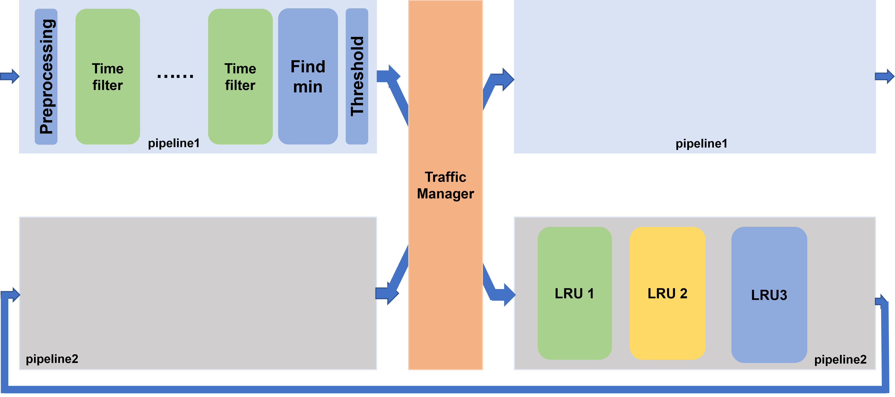

# P4LRU Testbed

In this part, we describe a basic environment for testing P4LRU and show how to reproduce the testbed results shown in the paper.

Each system code contains two parts: server code and P4 code. Compiling the server code in the server is for sending and receiving code, while the P4 code is compiled in the switch for the P4LRU implementation.


## Minimum environment requests

+ Two servers with NIC supported DPDK and DPDK version == 20.11(we cannot ensure DPDK code can be compiled in other versions)
+ a Tofino switch with SDE version == 9.2 
Notice: We **highly** recommend you to use SDE 9.2. We tested our P4 programs in SDE9.2, 9.5 and 9.7, but *LRUIndex* makes some logic mistakes and leads function errors under SDE 9.5 and 9.7. We guess it is because of the internal compilor error of Tofino SDE.

These two servers link with the Tofino switch. Packets can be transmitted through the switch


## Build P4 code

The P4 code of the three systems is in `./testbed/SYSTEM_NAME/P4/*.p4`. Each `*.p4` code corresponds the result line in the paper.

You can follow these steps to build and run the P4 program:

+ compile: Tofino SDE has `p4_build.sh` for compiling p4 code. There is an example:

  ```shell
  ./p4_build.sh /root/P4-LRU/testbed/LRUIndex/P4/lru_index.p4
  ```

+ run:  after compiling, you can run the P4 program

  ```shell
  cd $SDE
  ./run_switchd.sh -p lru_index
  ```

+ configuration: when running successfully, use ucli and bfrt to configurate the Tofino switch. Bfrt can be configuated with a python script. For testing, we give each P4 program a bfrt setting script.

```shell
ucli
#ucli config
#config parameters should change with your environment
port-add -/- 40G NONE
port-enb -/-
#for LRUIndex and LRUMon, they use two pipes, so you need to set loopback port for them
port-loopback ?/- mac-near
```

​	you can use a new shell to run the bfrt setting script(the parameters(port) in the python script should change with your environment):

```shell
./run_bfshell.sh -b /root/P4-LRU/testbed/LRUIndex/P4/set_lru_index.py
```

At this point, you know how to compile, run and configurate a P4 program.


Tips: If you want to run the experience in your environment, you need to change the port in the python script. For example, in `./testbed/LRUIndex/set_baseline_index.py`, your switch ports are possibly different to ours:

```python
# our topo: client -- port 128 -- switch -- port 144 -- server
# use port 44 and 36 as the recirculate ports

table = bfrt.baseline_index.pipe1.Ingress1.set_port_table_0
table.clear()

# table that send packets to recirculate ports
table.add_with_set_port_action(128, 44)
table.add_with_set_port_action(144, 36)

table = bfrt.baseline_index.pipe1.Ingress1.set_port_table_1
table.clear()
# table to send packets directly from server to client, vice versa
table.add_with_set_port_action(128, 144)
table.add_with_set_port_action(144, 128)

# ...

# table send packets from recirculate ports to server/client
table = bfrt.baseline_index.pipe2.Ingress2.set_port_table
table.clear()
table.add_with_set_port_action(44, 144)
table.add_with_set_port_action(36, 128)
```

if you use the topo: ` client -- port 128 -- switch -- port 132 -- server ` , port 32 and 36 as your recirculate ports, you need to change to :

```python
table = bfrt.baseline_index.pipe1.Ingress1.set_port_table_0
table.clear()

# table that send packets to recirculate ports
table.add_with_set_port_action(128, 32)
table.add_with_set_port_action(132, 36)

table = bfrt.baseline_index.pipe1.Ingress1.set_port_table_1
table.clear()
# table to send packets directly from server to client, vice versa
table.add_with_set_port_action(128, 132)
table.add_with_set_port_action(132, 128)


# table send packets from recirculate ports to server/client
table = bfrt.baseline_index.pipe2.Ingress2.set_port_table
table.clear()
table.add_with_set_port_action(32, 132)
table.add_with_set_port_action(36, 128)
```

`./testbed/LRUIndex/set_lru_index.py` in the similar way.

`LRUMon` set in the similar way. Meanwhile, LRUMon has a parameter called threshold, which controls the filter threshold entering the LRU system. You can set the parameter in the script, too.

`LRUTable` doesn't have the recirculate ports, so you just need to set the port linked with the client and the server.

## Build server code

There are some differences in the three system server code, which results in different building methods. We will give a separate presentation.

For convenience, we write a DPDK driver for sending and receiving packets with DPDK, which is in `./testbed/driver`. If you use a different DPDK version, you may need to change the code in the driver.


### LRUTable

code path: `./testbed/LRUTable/Server/`

You can follow these steps to begin a test:

+ compile: use `make` in `./testbed/LRUTable/Server/`

+ run the program:

  + run receiver first: 

  ```shell
  ./recver [-a NIC_code] -l 0 --file-prefix recver
  ```

  + run sender then: you can set the dataset path in `sender.cc`

  ```shell
  ./sender [-a NIC_code] -l 0 --file-prefix sender
  ```

+ waiting for finishing sending, `ctrl+C` to kill the receiver program. The results are shown in the shell.


### LRUMon

code path: `./testbed/LRUMon/Server/`

You can follow these steps to begin a test:

+ compile: use `make` in `./testbed/LRUMon/Server/`

+ run the program:

  + run receiver first: 

  ```shell
  ./recver [-a NIC_code] -l 0 --file-prefix recver
  ```

  + run sender then: you can set the dataset path in the last parameter

  ```shell
  ./sender [-a NIC_code] -l 0 --file-prefix sender DATASET_PATH
  ```

+ waiting for finishing sending, `ctrl+C` to kill the receiver program. The results are shown in the shell.


### LRUIndex

code path: `./testbed/LRUIndex/Server/`

The server part of LRUIndex is based on our another database system, which needs some lib supports. You need to install these library first:
```shell
apt install libtbb-dev
apt install libhiredis-dev
```

You can follow these steps to begin a test:

+ compile: use `make` in `./testbed/LRUIndex/Server/`

+ run the program:

  + run backend first: backend is the database for receiving dpdk query and insert packets

  ```shell
  ./backend/backend
  ```

  + run sender then: we make tests with ycsbc, you can set the thread number and the workload in the parameters

  ```shell
  # for convenience, we set our NIC in ycsbc.cc. You need change the '-a' parameter for your environment.
  ./ycsbc -db b_plus_tree -threads 1 -P workloads/workloadc.spec
  ```

+ waiting for finishing sending, `ctrl+C` to kill the backend program. The results are shown in the shell.


### An LRUMon structure for understanding the code


